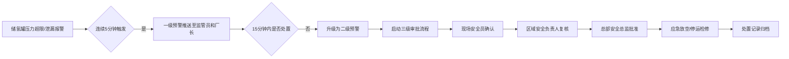
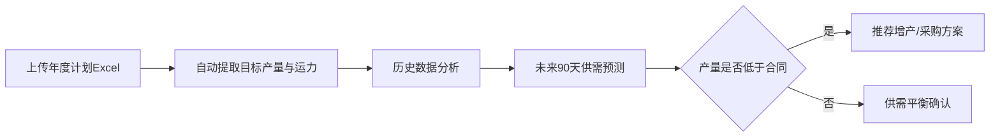

## 1. 产品概述

全国性氢能源全产业链安全监测分析平台，实时接入制氢、储氢、运氢、加注全链条多源数据，实现全产业链数字化监管、智能预警与科学决策。平台解决氢能产业安全监管分散、数据孤岛、风险预判不足等痛点，服务于国家/省/市三级安全监管部门及氢能企业。

- **核心价值**：统一数据标准，实时风险预警，智能供需预测，辅助安全决策
- **目标用户**：国家/省/市三级安全监管人员、氢能企业管理人员、总部安全总监
- **市场定位**：国家级氢能产业安全监管基础设施

## 2. 核心功能

### 2.1 用户角色

| 角色 | 注册方式 | 核心权限 |
|------|----------|----------|
| 国家级管理员 | 系统内置 | 查看全国数据、生成全国报告、高级预警处置审批 |
| 省级管理员 | 系统分配 | 查看本省数据、生成省级报告、二级预警审批 |
| 市级管理员 | 系统分配 | 查看本市数据、生成市级报告、一级预警处置 |
| 企业厂长 | 系统分配 | 查看本企业数据、接收预警、现场处置确认 |
| 现场安全员 | 系统分配 | 现场确认、提交处置报告 |
| 总部安全总监 | 系统分配 | 三级审批、应急决策 |

### 2.2 功能模块

1. **核心看板**：全国氢能产量热力图、安全风险排名、省份下钻分析
2. **实时监测**：制氢/储氢/运氢/加注实时数据监控
3. **预警中心**：一级/二级预警推送、三级审批流程、处置跟踪
4. **供需预测**：Excel计划上传、90天供需缺口预测、增产/采购方案推荐
5. **安全诊断**：周度自动报告、趋势分析、优化建议
6. **权限管理**：三级行政区划权限控制、数据隔离

### 2.3 页面详情

| 页面名称 | 模块名称 | 功能描述 |
|-----------|-------------|---------------------|
| 登录页 | 身份认证 | 账号密码登录、角色识别、权限跳转 |
| 核心看板 | 全国总览 | 产量热力图、风险排名地图、关键指标卡片 |
| 核心看板 | 省份下钻 | 7天生产趋势、储氢罐健康度分布、加氢站日均加注量 |
| 实时监测 | 制氢监测 | 电解水制氢数据、产量统计、纯度分析 |
| 实时监测 | 储氢监测 | 储氢罐压力/温湿度、安全系数计算、健康度评估 |
| 实时监测 | 运输监测 | 长管拖车GPS定位、泄漏报警、运输风险指数 |
| 实时监测 | 加注监测 | 加氢站设备参数、加注记录、利用率计算 |
| 预警中心 | 预警列表 | 一级/二级预警展示、预警状态跟踪 |
| 预警中心 | 三级审批 | 现场确认→区域复核→总监批准的审批流 |
| 预警中心 | 处置记录 | 预警处置全过程记录、时间线展示 |
| 供需预测 | 计划上传 | Excel年度生产运输计划解析、目标提取 |
| 供需预测 | 缺口分析 | 90天供需预测、缺口计算、合同预警 |
| 供需预测 | 方案推荐 | 增产方案、采购方案、优化建议 |
| 安全诊断 | 报告列表 | 周度报告自动生成、历史报告查询 |
| 安全诊断 | 报告详情 | 产量同比环比、事故分布、设备故障率、优化建议 |
| 系统管理 | 权限配置 | 用户管理、角色分配、行政区划权限设置 |

## 3. 核心流程

### 3.1 数据接入与处理流程

### 3.2 预警触发与处置流程

### 3.3 供需预测流程

## 4. 用户界面设计

### 4.1 设计风格

- **主色调**：科技蓝（#1890FF）作为主色，代表能源与科技感；安全红（#FF4D4F）用于预警；成功绿（#52C41A）用于正常状态；警示橙（#FAAD14）用于次要警告
- **字体**：使用 "Noto Sans SC" 作为主字体，搭配 "JetBrains Mono" 用于数据展示
- **布局**：左侧导航栏 + 顶部状态栏 + 主体内容区的经典B端布局，高密度信息展示
- **卡片设计**：圆角8px，微妙阴影，层次分明
- **图标风格**：线性图标，统一24px网格，颜色与功能匹配

### 4.2 页面设计概述

| 页面名称 | 模块名称 | UI元素 |
|-----------|-------------|-------------|
| 核心看板 | 全国总览 | 中国地图热力图（ECharts）、Top10风险排名条形图、关键指标卡片、省份切换下拉框、产业链环节切换标签页 |
| 核心看板 | 省份下钻 | 7天趋势折线图、储氢罐健康度饼图、加氢站柱状图、面包屑导航 |
| 实时监测 | 储氢监测 | 储氢罐3D示意图、压力/温湿度实时仪表盘、安全系数进度条、设备列表表格 |
| 预警中心 | 预警列表 | 预警级别颜色标识、预警时间线、处置状态标签、审批进度条 |
| 供需预测 | 缺口分析 | 90天预测面积图、供需对比柱状图、缺口数值卡片、方案推荐列表 |
| 安全诊断 | 报告详情 | 报告封面、多维度统计图表、优化建议卡片、下载按钮 |

### 4.3 响应式设计

- **桌面优先**：针对1920×1080及以上分辨率优化，支持最小1366×768
- **数据可视化自适应**：图表组件自动响应容器尺寸变化
- **侧边栏可折叠**：小屏设备可折叠导航栏以增大内容区域
- **表格响应式**：横向滚动支持，列宽自适应

### 4.4 动效设计

- **页面加载**：骨架屏 + 数据渐入动画，分区块延迟加载
- **数据更新**：实时数据变化时的数字滚动动效
- **预警通知**：顶部滑入通知 + 轻微抖动效果 + 呼吸灯动效
- **图表交互**：悬停高亮、点击下钻的平滑过渡动画
- **审批流程**：节点状态变化的进度条动画

## 5. 非功能需求

### 5.1 性能要求

- 实时数据延迟≤2秒
- 热力图渲染≤500ms
- 页面首屏加载≤3秒
- 支持10000+并发用户

### 5.2 安全要求

- 三级权限数据隔离
- 操作日志完整审计
- 敏感数据加密存储
- HTTPS传输加密

### 5.3 可用性要求

- 系统可用性≥99.9%
- 支持7×24小时运行
- 数据备份与灾难恢复
