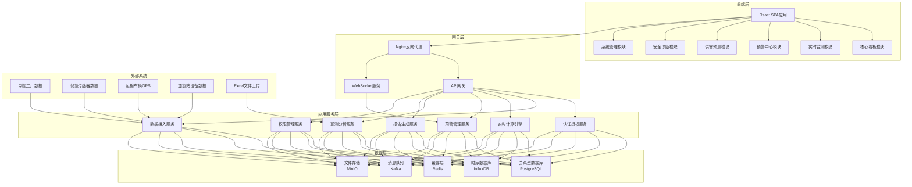
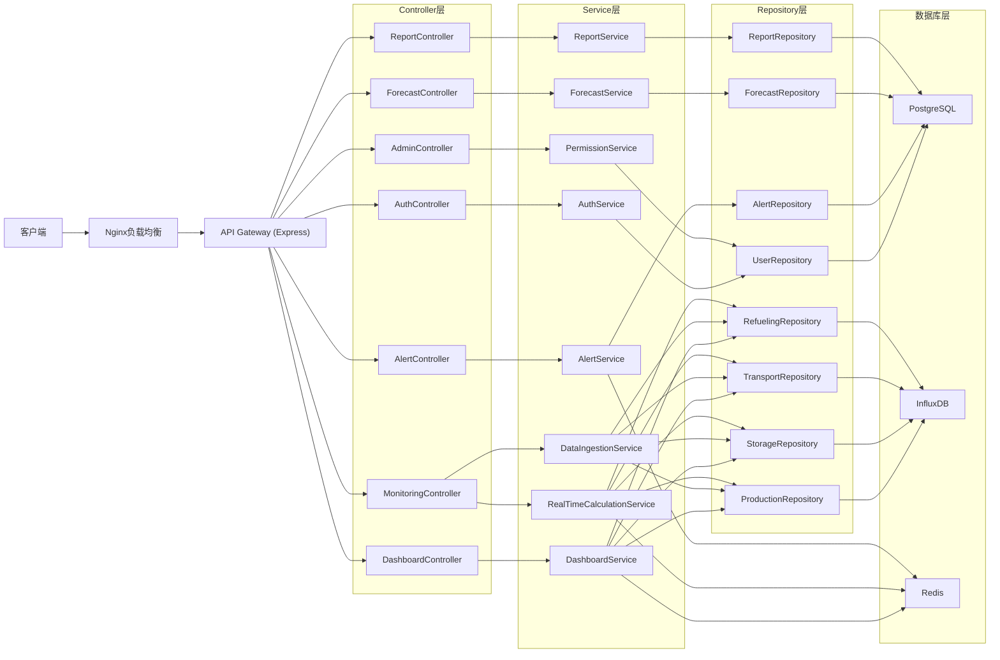
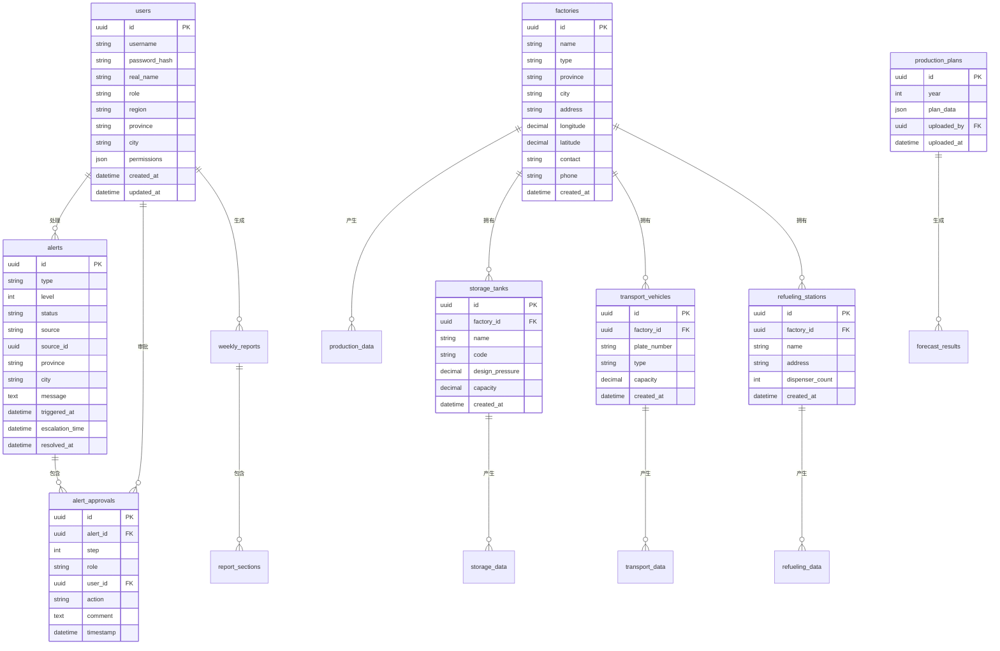

## 1. 架构设计



## 2. 技术描述

### 2.1 前端技术栈

| 技术 | 版本 | 用途 |
|------|------|------|
| React | 18.x | 前端框架 |
| TypeScript | 5.x | 类型安全 |
| Vite | 5.x | 构建工具 |
| React Router | 6.x | 路由管理 |
| Zustand | 4.x | 状态管理 |
| Ant Design | 5.x | UI组件库 |
| ECharts | 5.x | 数据可视化 |
| Tailwind CSS | 3.x | 样式框架 |
| Socket.IO Client | 4.x | 实时通信 |
| xlsx | 0.18.x | Excel解析 |
| Axios | 1.x | HTTP请求 |
| Day.js | 1.x | 日期处理 |

### 2.2 后端技术栈

| 技术 | 版本 | 用途 |
|------|------|------|
| Node.js | 20.x | 运行时环境 |
| Express | 4.x | Web框架 |
| TypeScript | 5.x | 类型安全 |
| Prisma | 5.x | ORM框架 |
| Socket.IO | 4.x | 实时通信服务 |
| Bull | 4.x | 任务队列 |
| JWT | 9.x | 认证令牌 |
| Joi | 17.x | 参数校验 |
| Winston | 3.x | 日志管理 |

### 2.3 数据库设计

- **PostgreSQL**: 存储业务数据（用户、角色、预警、报告、配置等）
- **InfluxDB**: 存储时序传感器数据（压力、温度、GPS轨迹等）
- **Redis**: 缓存热点数据、实时计算结果、Session管理
- **Kafka**: 数据接入消息队列，解耦数据接入与处理

## 3. 路由定义

| 路由 | 页面 | 权限 |
|-------|------|------|
| /login | 登录页 | 公开 |
| /dashboard | 核心看板-全国总览 | 登录用户 |
| /dashboard/province/:code | 核心看板-省份下钻 | 登录用户 |
| /monitoring/hydrogen-production | 实时监测-制氢监测 | 登录用户 |
| /monitoring/storage | 实时监测-储氢监测 | 登录用户 |
| /monitoring/transport | 实时监测-运输监测 | 登录用户 |
| /monitoring/refueling | 实时监测-加注监测 | 登录用户 |
| /alerts | 预警中心-预警列表 | 登录用户 |
| /alerts/:id/approval | 预警中心-三级审批 | 相关审批人 |
| /alerts/:id/history | 预警中心-处置记录 | 登录用户 |
| /forecast/upload | 供需预测-计划上传 | 管理员 |
| /forecast/analysis | 供需预测-缺口分析 | 管理员 |
| /forecast/recommendations | 供需预测-方案推荐 | 管理员 |
| /reports | 安全诊断-报告列表 | 登录用户 |
| /reports/:id | 安全诊断-报告详情 | 登录用户 |
| /admin/users | 系统管理-用户管理 | 超级管理员 |
| /admin/permissions | 系统管理-权限配置 | 超级管理员 |

## 4. API 定义

### 4.1 认证接口

```typescript
// 登录请求
interface LoginRequest {
  username: string;
  password: string;
}

// 登录响应
interface LoginResponse {
  token: string;
  user: {
    id: string;
    username: string;
    realName: string;
    role: 'national' | 'provincial' | 'municipal' | 'factory' | 'safety' | 'director';
    region?: string;
    province?: string;
    city?: string;
    permissions: string[];
  };
}

// POST /api/auth/login
// POST /api/auth/logout
// GET /api/auth/me
```

### 4.2 看板接口

```typescript
// 全国总览数据
interface DashboardOverviewResponse {
  totalProduction: number;
  totalStorage: number;
  totalTransport: number;
  totalRefueling: number;
  activeAlerts: { level1: number; level2: number };
  safetyScore: number;
  provinceProduction: Array<{ province: string; code: string; value: number }>;
  riskRanking: Array<{ province: string; code: string; riskIndex: number; level: string }>;
}

// 省份下钻数据
interface ProvinceDetailResponse {
  province: string;
  code: string;
  productionTrend: Array<{ date: string; production: number; purity: number }>;
  storageHealth: Array<{ level: string; count: number; percentage: number }>;
  refuelingStats: Array<{ station: string; dailyAmount: number; utilization: number }>;
  factories: Array<{
    id: string;
    name: string;
    type: string;
    dailyProduction: number;
    safetyScore: number;
  }>;
}

// GET /api/dashboard/overview
// GET /api/dashboard/province/:code
```

### 4.3 实时监测接口

```typescript
// 制氢数据
interface ProductionData {
  id: string;
  factoryId: string;
  factoryName: string;
  timestamp: Date;
  electrolyzerCurrent: number;
  electrolyzerVoltage: number;
  hydrogenProduction: number;
  hydrogenPurity: number;
  temperature: number;
  pressure: number;
}

// 储氢罐数据
interface StorageTankData {
  id: string;
  tankId: string;
  tankName: string;
  factoryId: string;
  timestamp: Date;
  pressure: number;
  designPressure: number;
  temperature: number;
  humidity: number;
  level: number;
  safetyFactor: number;
  healthStatus: 'excellent' | 'good' | 'warning' | 'danger';
}

// 运输数据
interface TransportData {
  id: string;
  vehicleId: string;
  plateNumber: string;
  timestamp: Date;
  longitude: number;
  latitude: number;
  speed: number;
  pressure: number;
  temperature: number;
  leakDetected: boolean;
  leakLevel: number;
  riskIndex: number;
}

// 加氢站数据
interface RefuelingData {
  id: string;
  stationId: string;
  stationName: string;
  timestamp: Date;
  dispenserStatus: string;
  totalDispensed: number;
  dailyDispensed: number;
  pressure: number;
  temperature: number;
  utilizationRate: number;
}

// GET /api/monitoring/production
// GET /api/monitoring/storage
// GET /api/monitoring/transport
// GET /api/monitoring/refueling
// WebSocket: /ws/monitoring
```

### 4.4 预警接口

```typescript
// 预警信息
interface Alert {
  id: string;
  type: 'storage_overpressure' | 'transport_leak' | 'equipment_failure' | 'other';
  level: 1 | 2;
  status: 'pending' | 'processing' | 'approved' | 'resolved' | 'escalated';
  source: string;
  sourceId: string;
  location: string;
  province: string;
  city: string;
  message: string;
  triggeredAt: Date;
  escalationTime?: Date;
  resolvedAt?: Date;
  approvalFlow?: Array<{
    step: number;
    role: string;
    userId: string;
    userName: string;
    action: 'pending' | 'approved' | 'rejected';
    comment: string;
    timestamp?: Date;
  }>;
}

// 创建预警
// POST /api/alerts
// 获取预警列表
// GET /api/alerts
// 获取预警详情
// GET /api/alerts/:id
// 提交审批
// POST /api/alerts/:id/approve
// 处置完成
// POST /api/alerts/:id/resolve
```

### 4.5 供需预测接口

```typescript
// 上传Excel计划
// POST /api/forecast/upload (multipart/form-data)

// 提取的计划数据
interface PlanData {
  year: number;
  targets: Array<{
    province: string;
    productionTarget: number;
    transportCapacity: number;
    refuelingTarget: number;
  }>;
}

// 预测结果
interface ForecastResult {
  forecastDays: number;
  supplyForecast: Array<{ date: string; supply: number }>;
  demandForecast: Array<{ date: string; demand: number }>;
  gaps: Array<{
    date: string;
    gap: number;
    severity: 'low' | 'medium' | 'high';
    contractRisk: boolean;
  }>;
  recommendations: Array<{
    type: 'production' | 'procurement' | 'optimization';
    title: string;
    description: string;
    estimatedCost: number;
    priority: 'high' | 'medium' | 'low';
  }>;
}

// GET /api/forecast/plan
// GET /api/forecast/analysis
// GET /api/forecast/recommendations
```

### 4.6 报告接口

```typescript
interface WeeklyReport {
  id: string;
  week: string;
  startDate: Date;
  endDate: Date;
  region: string;
  summary: {
    totalProduction: number;
    productionYoY: number;
    productionMoM: number;
    alertCount: number;
    alertResolutionRate: number;
    equipmentFailureRate: number;
  };
  accidentDistribution: Array<{ type: string; count: number; percentage: number }>;
  productionTrend: Array<{ date: string; production: number }>;
  optimizationSuggestions: Array<{ area: string; suggestion: string; priority: string }>;
}

// GET /api/reports
// GET /api/reports/:id
// GET /api/reports/:id/download
// POST /api/reports/generate
```

## 5. 服务器架构图



## 6. 数据模型

### 6.1 ER图



### 6.2 DDL语句

```sql
-- 用户表
CREATE TABLE users (
    id UUID PRIMARY KEY DEFAULT gen_random_uuid(),
    username VARCHAR(50) UNIQUE NOT NULL,
    password_hash VARCHAR(255) NOT NULL,
    real_name VARCHAR(50) NOT NULL,
    role VARCHAR(20) NOT NULL CHECK (role IN ('national', 'provincial', 'municipal', 'factory', 'safety', 'director')),
    region VARCHAR(50),
    province VARCHAR(50),
    city VARCHAR(50),
    permissions JSONB DEFAULT '[]',
    created_at TIMESTAMPTZ DEFAULT CURRENT_TIMESTAMP,
    updated_at TIMESTAMPTZ DEFAULT CURRENT_TIMESTAMP
);

-- 工厂表
CREATE TABLE factories (
    id UUID PRIMARY KEY DEFAULT gen_random_uuid(),
    name VARCHAR(100) NOT NULL,
    type VARCHAR(50) NOT NULL,
    province VARCHAR(50) NOT NULL,
    city VARCHAR(50) NOT NULL,
    address VARCHAR(255),
    longitude DECIMAL(10, 7),
    latitude DECIMAL(10, 7),
    contact VARCHAR(50),
    phone VARCHAR(20),
    created_at TIMESTAMPTZ DEFAULT CURRENT_TIMESTAMP
);

-- 储氢罐表
CREATE TABLE storage_tanks (
    id UUID PRIMARY KEY DEFAULT gen_random_uuid(),
    factory_id UUID REFERENCES factories(id),
    name VARCHAR(50) NOT NULL,
    code VARCHAR(50) UNIQUE NOT NULL,
    design_pressure DECIMAL(10, 2) NOT NULL,
    capacity DECIMAL(10, 2) NOT NULL,
    created_at TIMESTAMPTZ DEFAULT CURRENT_TIMESTAMP
);

-- 预警表
CREATE TABLE alerts (
    id UUID PRIMARY KEY DEFAULT gen_random_uuid(),
    type VARCHAR(50) NOT NULL,
    level INTEGER NOT NULL CHECK (level IN (1, 2)),
    status VARCHAR(20) NOT NULL DEFAULT 'pending',
    source VARCHAR(50) NOT NULL,
    source_id UUID,
    province VARCHAR(50) NOT NULL,
    city VARCHAR(50) NOT NULL,
    message TEXT NOT NULL,
    triggered_at TIMESTAMPTZ NOT NULL,
    escalation_time TIMESTAMPTZ,
    resolved_at TIMESTAMPTZ,
    created_at TIMESTAMPTZ DEFAULT CURRENT_TIMESTAMP
);

-- 审批流程表
CREATE TABLE alert_approvals (
    id UUID PRIMARY KEY DEFAULT gen_random_uuid(),
    alert_id UUID REFERENCES alerts(id),
    step INTEGER NOT NULL,
    role VARCHAR(50) NOT NULL,
    user_id UUID REFERENCES users(id),
    action VARCHAR(20) NOT NULL,
    comment TEXT,
    timestamp TIMESTAMPTZ
);

-- 周度报告表
CREATE TABLE weekly_reports (
    id UUID PRIMARY KEY DEFAULT gen_random_uuid(),
    week VARCHAR(20) NOT NULL,
    start_date DATE NOT NULL,
    end_date DATE NOT NULL,
    region VARCHAR(50),
    summary JSONB NOT NULL,
    accident_distribution JSONB NOT NULL,
    production_trend JSONB NOT NULL,
    optimization_suggestions JSONB NOT NULL,
    generated_by UUID REFERENCES users(id),
    created_at TIMESTAMPTZ DEFAULT CURRENT_TIMESTAMP,
    UNIQUE(week, region)
);

-- 创建索引
CREATE INDEX idx_alerts_province ON alerts(province);
CREATE INDEX idx_alerts_status ON alerts(status);
CREATE INDEX idx_alerts_triggered_at ON alerts(triggered_at DESC);
CREATE INDEX idx_storage_tanks_factory_id ON storage_tanks(factory_id);
CREATE INDEX idx_users_role ON users(role);
```

## 7. 目录结构

```
project/
├── frontend/
│   ├── src/
│   │   ├── api/              # API接口定义
│   │   ├── components/       # 公共组件
│   │   │   ├── charts/       # 图表组件
│   │   │   ├── layout/       # 布局组件
│   │   │   └── ui/           # UI组件
│   │   ├── pages/            # 页面组件
│   │   │   ├── dashboard/    # 看板页面
│   │   │   ├── monitoring/   # 监测页面
│   │   │   ├── alerts/       # 预警页面
│   │   │   ├── forecast/     # 预测页面
│   │   │   ├── reports/      # 报告页面
│   │   │   └── admin/        # 管理页面
│   │   ├── store/            # 状态管理
│   │   ├── hooks/            # 自定义Hooks
│   │   ├── utils/            # 工具函数
│   │   ├── types/            # TypeScript类型定义
│   │   ├── styles/           # 全局样式
│   │   ├── App.tsx
│   │   └── main.tsx
│   ├── public/
│   ├── package.json
│   ├── tsconfig.json
│   ├── vite.config.ts
│   └── tailwind.config.js
├── backend/
│   ├── src/
│   │   ├── controllers/      # 控制器
│   │   ├── services/         # 业务逻辑
│   │   ├── repositories/     # 数据访问
│   │   ├── models/           # 数据模型
│   │   ├── routes/           # 路由定义
│   │   ├── middleware/       # 中间件
│   │   ├── utils/            # 工具函数
│   │   ├── types/            # 类型定义
│   │   ├── config/           # 配置
│   │   └── server.ts
│   ├── prisma/               # Prisma schema
│   ├── package.json
│   └── tsconfig.json
├── docker/
├── .trae/
│   └── documents/
└── docker-compose.yml
```
